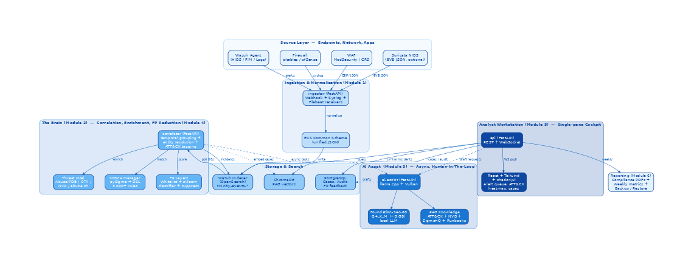

# Architecture

This page is a living summary of the TR1NITY architecture. The authoritative reference is the [Phase-1 PDF report](report.md), which includes the full citation set and rendered diagrams.

For the version-controlled architecture document, see the [`ARCHITECTURE.md`](https://github.com/whereisjojii/TR1NITY/blob/main/ARCHITECTURE.md) at the repo root.

## High-level diagram

{ loading=lazy }

## The six modules

| # | Module | Tech | Phase |
|---|--------|------|-------|
| **M1** | Ingestion & Normalization | FastAPI + Filebeat + ECS schema | 1 |
| **M2** | Correlation & Enrichment | FastAPI + asyncio + pySigma | 2 |
| **M3** | AI Assist (HITL) | `llama.cpp` + Vulkan + Foundation-Sec-8B Q4 | 5 |
| **M4** | False-Positive Handling | scikit-learn + YAML whitelists | 4 |
| **M5** | Analyst Workstation | React + Tailwind + shadcn/ui | 3 |
| **M6** | Knowledge, Audit & Reporting | WeasyPrint + PostgreSQL + cron | 6 |

## Service inventory

| Service | Port | Purpose |
|---------|------|---------|
| `wazuh-manager` | 1514, 1515, 55000 | HIDS server |
| `wazuh-indexer` | 9200 | Event store (OpenSearch fork) |
| `postgres` | 5432 | Cases, audit, FP feedback, runbook history |
| `chromadb` | 8004 | Vector store for RAG |
| `ingestor` | 8001 | Webhook + syslog + ModSecurity → ECS |
| `correlator` | 8002 | Periodic correlation loop |
| `ai-assist` | 8003 | Async drafting service |
| `api` | 8000 | Public REST + WebSocket |

Total RAM at full tilt: ~9 GB. Headroom on a 16 GB host: ~7 GB.

## Data flow

1. **Adversary action** → Wazuh + firewall + WAF emit.
2. **Ingestor** normalizes everything to ECS in `tr1nity-events-*`.
3. **Correlator** (every 30 s) groups within a 5-min window, tags ATT&CK, enriches with threat intel, writes incidents to `tr1nity-incidents-*`.
4. **FP scorer** assigns `fp_score` ∈ [0, 1].
5. **Cockpit** renders incidents sorted ascending by `fp_score`.
6. **Analyst triage** (mark FP, open case, deploy SIGMA, close).
7. **AI Assist** drafts the post-mortem on case closure (async).
8. **Reporting** journals everything to PostgreSQL, generates compliance PDFs and weekly metrics.

## What's deliberately not here

See [`docs/planning/02-final-scope.md`](planning/02-final-scope.md) for the rationale on these cuts:

- No multi-class network-flow ML on production traffic.
- No self-rewriting SIGMA rule generator.
- No UEBA module.
- No Markov-chain kill-chain prediction.
- No bundled TheHive / Cortex / MISP servers.
- No always-on LLM enrichment of every alert.
