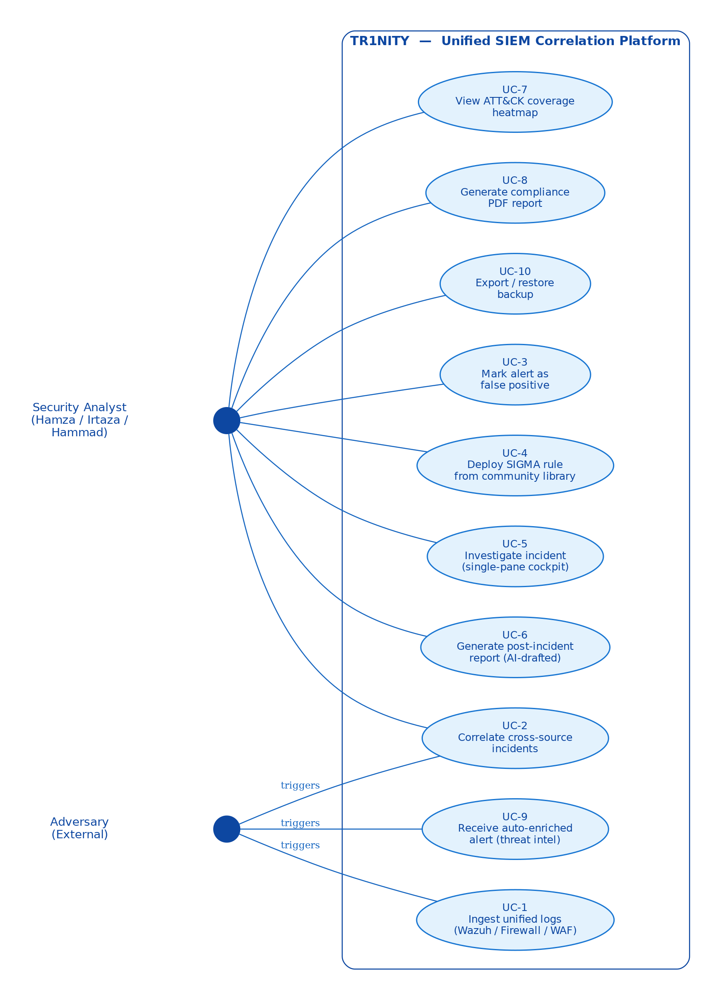
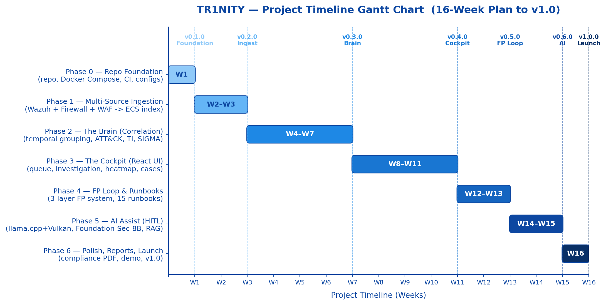

# Phase-1 Report

The academic-style Phase-1 project documentation lives at [`docs/report/tr1nity_report.pdf`](report/tr1nity_report.pdf).

## What's in it

- Cover page with authors (Hamza, Irtaza, Hammad) and Air University Islamabad branding
- Working clickable Table of Contents
- Abstract
- Introduction (background, importance, problem statement, proposed solution)
- Literature Review with comparative analysis table and critical gap analysis
- Methodology (component design + end-to-end workflow + architecture diagram in landscape)
- Use Case Diagram + 10 detailed use case descriptions
- Test Cases (12 planned cases mapped to the six modules)
- Market Value (target users, market relevance, economic positioning, competitor comparison)
- Gantt Chart (16-week / 6-phase timeline with milestone tags)
- Results & Conclusion
- IEEE-style References (15 academic + industry sources)
- Appendices (module listing, free-tier API summary, system requirements, GitHub storage strategy)

## Source

The LaTeX source, IEEE bibliography, and figure scripts are in [`docs/report/`](https://github.com/whereisjojii/TR1NITY/tree/main/docs/report). To rebuild:

```bash
make report
```

Requires `pdflatex`, `biber`, `graphviz`, and `python3` with `matplotlib`.

## Diagrams (rendered)

### Architecture

{ loading=lazy }

### Use cases

{ loading=lazy }

### Gantt chart

{ loading=lazy }
